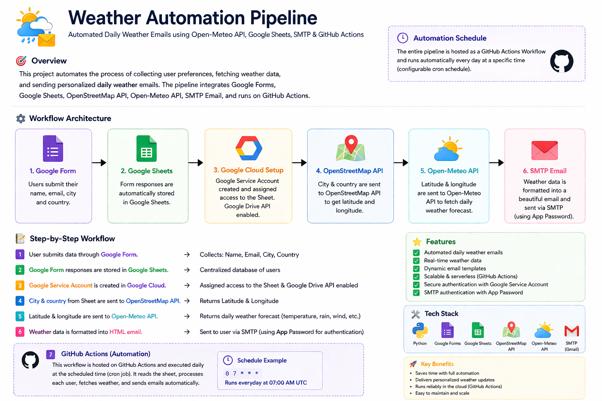

# 🌤️ Weather Automation Pipeline

An automated system that collects user data, fetches real-time weather forecasts, and sends personalized daily weather emails — fully running on GitHub Actions.

---

## 📌 Overview

This project automates the complete workflow of:

- Collecting user preferences via Google Form  
- Storing responses in Google Sheets  
- Fetching weather data using APIs  
- Sending personalized email reports  
- Running automatically every day  

---

## 🧠 Workflow Architecture



---

## 🔄 How It Works

### 1. 📝 Google Form
Users submit:
- Name  
- Email  
- City  
- Country  

---

### 2. 📊 Google Sheets
- Form responses are automatically stored  
- Acts as a database for users  

---

### 3. 🔐 Google Cloud Setup
- Service Account created  
- Google Drive API enabled  
- Sheet access granted to service account  

---

### 4. 🌍 Geolocation (OpenStreetMap API)
- City + Country → Latitude & Longitude  

---

### 5. 🌦️ Weather Data (Open-Meteo API)
- Fetches:
  - Temperature (max/min)
  - Rain probability
  - Wind speed
  - UV index
  - Sunrise & Sunset  

---

### 6. 📧 Email Generation (SMTP)
- HTML email template  
- Dynamic weather-based messages  
- Sent via Gmail App Password  

---

### 7. ⚙️ Automation (GitHub Actions)
- Runs daily using cron job  
- Reads sheet → processes data → sends emails  

---

## ⏰ Automation Schedule
cron: '30 1 * * *'   # Runs daily at 7:00 AM IST

---
## ✨ Features
- ✅ Fully automated pipeline
- ✅ Real-time weather updates
- ✅ Personalized email reports
- ✅ Dynamic smart messages
- ✅ City-level API optimization
- ✅ Secure credential handling (GitHub Secrets)
- ✅ Serverless execution (GitHub Actions)

---
## 🛠️ Tech Stack
- Python
- Google Forms
- Google Sheets API (gspread)
- OpenStreetMap API
- Open-Meteo API
- SMTP (Gmail)
- GitHub Actions

## 🔐 Environment Variables (Secrets)

Set these in GitHub Actions:
- GOOGLE_SERVICE_ACCOUNT_JSON
- SENDER_EMAIL
- SENDER_APP_PASSWORD
- SHEET_NAME

---
```yaml

🚀 Getting Started
1. Clone repo
git clone <your-repo-url>
cd weather-automation-pipeline
2. Install dependencies
pip install -r requirements.txt
3. Add credentials
Add .env (local)
Or GitHub Secrets (for deployment)

📬 Example Email
Hi Yash 👋

🌧️ Rain expected in Vapi!

🌡️ Max: 30°C
🌡️ Min: 25°C
🌧️ Rain Chance: 80%

👉 Don’t forget your umbrella!
📈 Future Improvements
🌍 Better geolocation accuracy
🎯 Weather-based GIF integration
📊 Dashboard / analytics
🧠 AI-based weather insights
👨‍💻 Author

Yash Patel

⭐ If you like this project

Give it a star on GitHub ⭐
